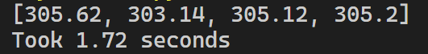
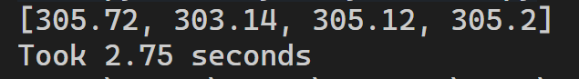

# Async Weather API Fetcher

## Overview

The async script demonstrates how to fetch **weather data concurrently** for multiple cities using [**Python asyncio**](https://docs.python.org/3/library/asyncio.html) and [**httpx**](https://pypi.org/project/httpx/).
Instead of calling each API one after another (sequential), it runs them **all at once** using async programming.

## How It Works

1. **Event Loop (`asyncio.run`)**

   - Creates an event loop that manages and schedules async tasks.

2. **Coroutine (`async def fetch`)**

   - Defines an async function that fetches weather data for one city.
   - Uses `httpx.AsyncClient` with `await` → the call is **non-blocking**.

3. **Tasks (`asyncio.create_task`)**

   - Each city request is wrapped into a Task → scheduled immediately in the event loop.
   - All tasks run concurrently.

4. **Gather (`asyncio.gather`)**

   - Collects results from all tasks.
   - Ensures program waits until **all API calls finish**.

## Expected Behavior

If each API call takes \~1s:

| Approach                  | Total Time              |
| ------------------------- | ----------------------- |
| Sequential (`requests`)   | \~4s (1 + 1 + 1 + 1)    |
| Async (`httpx` + asyncio) | \~1s (all run together) |

### Benefits?!

- Async I/O allows **concurrent API calls** in one worker.
- Perfect for I/O-bound tasks like fetching external APIs.
- Each request runs independently; users don’t wait for others.
- Shows the **power of asyncio + httpx** compared to blocking `requests`.

### Results:

Async:

Sync:

